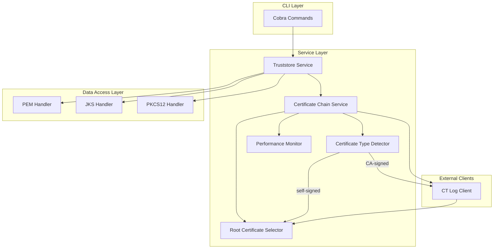

### 1. Introduction

This document outlines the overall project architecture for the `truststore` CLI, including backend systems, shared services, and non-UI specific concerns. Its primary goal is to serve as the guiding architectural blueprint for AI-driven development, ensuring consistency and adherence to chosen patterns and technologies.

**Relationship to Frontend Architecture:**
This project is a command-line interface (CLI) and does not have a user interface. Therefore, a separate Frontend Architecture Document is not required.

#### Starter Template or Existing Project
N/A. The project will be built from scratch using Go (Golang), as specified in the PRD. No starter templates or existing codebases will be used. This allows for a clean implementation tailored specifically to the project's requirements.

#### Change Log

| Date | Version | Description | Author |
| :--- | :--- | :--- | :--- |
| 2025-08-26 | 1.0 | Initial architecture draft | Winston (Architect) |
| 2025-09-04 | 1.1 | Updated for Epic 4: CT Log Service Optimization with certificate type detection and conditional processing | Winston (Architect) |

### 2. High Level Architecture

#### Technical Summary
The system will be a monolithic, self-contained command-line interface (CLI) tool developed in Go (Golang). Its architecture will be organized around a central command-and-control structure using the Cobra library, with distinct packages for handling different truststore formats (PEM, JKS, PKCS12) and for core functionalities like certificate chain completion via Certificate Transparency logs. The design now incorporates intelligent certificate type detection and conditional CT log processing to optimize performance and eliminate unnecessary network calls for self-signed certificates. The architecture prioritizes simplicity, reliability, performance optimization, and cross-platform compatibility, directly supporting the PRD goals of creating an intuitive and powerful certificate management tool.

#### High Level Overview
*   **Architectural Style:** Monolithic CLI Application. All logic is compiled into a single, self-contained binary.
*   **Repository Structure:** A single repository will be used, as specified in the PRD.
*   **Primary User Interaction Flow:** The user interacts with the tool via a terminal by executing commands like `truststore list <source>`, `truststore add <source> --target <file>`, and `truststore rm <source> --target <file>`. The application processes the request, interacts with the local filesystem, remote servers, or CT log APIs as needed, and prints the result to standard output/error.
*   **Key Architectural Decisions:**
    *   **Go (Golang):** Chosen for its excellent support for creating single, dependency-free, cross-platform binaries and its strong standard library for cryptography and networking.
    *   **Cobra Library:** A popular Go library for building modern CLIs. It simplifies command, argument, and flag parsing.
    *   **Interface-based Truststore Handling:** Each truststore type (PEM, JKS, PKCS12) will implement a common `Truststore` interface, allowing for consistent handling of different file formats.
    *   **Intelligent Certificate Processing:** Certificate type detection determines whether certificates are self-signed or CA-signed before deciding on CT log queries, optimizing performance and reducing external API dependencies.

#### High Level Project Diagram
```mermaid
graph TD
    subgraph User
        A[Terminal User]
    end

    subgraph truststore CLI
        B(main.go / Cobra)
        C{Command Router}
        D[list]
        E[add]
        F[rm]
        G[Certificate Chain Service]
        G1[Certificate Type Detection]
        G2[Root Certificate Selection]
        H[Truststore Handlers]
        M[Performance Monitoring]
    end

    subgraph External Services
        I[Remote Server (TLS)]
        J[CT Log API (crt.sh)]
    end

    subgraph Local Filesystem
        K[PEM/JKS/P12 Files]
    end

    A --> B
    B --> C
    C -->|list| D
    C -->|add| E
    C -->|rm| F

    D --> I
    D --> K

    E --> G
    E --> H
    F --> G
    F --> H

    G --> G1
    G1 -->|self-signed| G2
    G1 -->|CA-signed| J
    G --> G2
    G --> M
    J --> G2
    H --> K
```

#### Architectural and Design Patterns
*   **Command Pattern:** The Cobra library inherently uses the command pattern to encapsulate all the information needed to perform an action. *Rationale:* This is the standard, most effective way to structure a CLI application, providing clear separation of concerns for each command.
*   **Strategy Pattern:** Each truststore format (PEM, JKS, PKCS12) will be handled by a specific "strategy" (a struct that implements a common `Truststore` interface with methods like `Read`, `Add`, `Remove`). *Rationale:* This allows the core logic to remain agnostic to the file format it's operating on, making the system easy to extend with new formats in the future.
*   **Dependency Injection:** Core services, like the Certificate Chain Completion service or the truststore handlers, will be initialized once and passed into the commands that need them. *Rationale:* This improves testability by allowing services to be mocked, and it clarifies the dependencies of each command.
*   **Conditional Processing Pattern:** Certificate type detection drives conditional logic for CT log queries, with self-signed certificates processed locally and CA-signed certificates using external APIs. *Rationale:* Optimizes performance by eliminating unnecessary network calls and provides offline capability for self-signed certificate operations.
*   **Observer Pattern (Metrics):** Performance monitoring components observe certificate processing events to collect metrics and timing data. *Rationale:* Provides visibility into optimization effectiveness without coupling monitoring logic to core business functions.

### 3. Tech Stack

#### Cloud Infrastructure
This project is a self-contained CLI tool that runs on a user's local machine. It does not require dedicated cloud infrastructure. It only makes outbound requests to public services (remote servers for TLS certificates and Certificate Transparency log APIs), which does not necessitate provisioning our own cloud resources.

#### Technology Stack Table
The following table lists the specific technologies and versions that will be used to build the project. These choices are considered final and will be the single source of truth for development.

| Category | Technology | Version | Purpose | Rationale |
| :--- | :--- | :--- | :--- | :--- |
| **Language** | Go | 1.25.0 | Primary development language | As per PRD: excellent for fast, cross-platform, single-binary CLIs with strong networking/crypto libraries. |
| **CLI Framework** | `github.com/spf13/cobra` | v1.8.0 | Building the CLI command structure | The most popular and robust CLI library for Go. Provides commands, flags, and help text generation. |
| **JKS Library** | `github.com/pavlo-v-chernykh/keystore-go` | v4.5.0 | Reading/writing JKS files | A well-maintained, pure Go library that supports the required Java Keystore format. |
| **PKCS12 Library** | `software.sslmate.com/src/go-pkcs12` | v0.6.0 | Reading/writing PKCS12 files | A specialized, robust library from a trusted source (SSLMate) for handling the PKCS12 format. |
| **Testing** | Go Standard Library (`testing`) | 1.25.0 | Unit and Integration testing | Go's built-in testing package is simple, powerful, and the standard for the ecosystem. No external framework needed. |
| **Linting** | `golangci-lint` | v1.59.1 | Code quality and style enforcement | The de-facto standard meta-linter for Go projects. Enforces idiomatic code and catches common errors. |
| **Dev Tooling** | `asdf` | 0.18.0 | Tool version management | Ensures consistent development environments across the team for all languages and tools. |
| **Dev Tooling** | `asdf-golang` | (managed by asdf) | `asdf` plugin for Go | Manages the project's Go version via the `.tool-versions` file, ensuring consistency. |
| **Dev Tooling** | `java` (Temurin) | 17.0.16+8 | JKS test data generation | Provides `keytool` for generating JKS test files during development and testing. |
| **CI/CD** | GitHub Actions | N/A | Automation of testing and releases | As per PRD: Native to GitHub, excellent integration for building, testing, and deploying binaries to GitHub Releases. |

### 4. Data Models

#### `Certificate`
*   **Purpose:** To represent a single X.509 digital certificate in memory. This is the fundamental building block of our application.
*   **Key Attributes:** We will use the standard `crypto/x509.Certificate` struct provided by Go's standard library. This is a comprehensive model that includes all necessary attributes, such as:
    *   `Subject` and `Issuer`
    *   `SerialNumber`
    *   `NotBefore`, `NotAfter` (Validity Period)
    *   `PublicKey` and `SignatureAlgorithm`
    *   `Extensions` (including AIA for potential future use)
*   **Relationships:** A `Certificate` can be an issuer for another `Certificate`, forming a chain relationship.

#### `Truststore` (Interface)
*   **Purpose:** To provide a generic, abstract representation of a certificate container, regardless of its file format (PEM, JKS, or PKCS12).
*   **Key Attributes:**
    *   This will be defined as a Go `interface` rather than a concrete struct.
    *   It will define a set of behaviors, such as `ReadCertificates()`, `AddCertificate(cert)`, and `RemoveCertificate(cert)`.
*   **Relationships:** A `Truststore` implementation will contain a collection of `Certificate` objects. The specific implementation (e.g., `JksTruststore`) will handle the details of how those certificates are stored and retrieved from the file.

### 5. Components

#### `CLI (Cobra Commands)`
*   **Responsibility:** This is the user-facing layer of the application. It defines the `list`, `add`, and `rm` commands, parses all user input (arguments and flags), and orchestrates the workflow by calling the appropriate services.
*   **Key Interfaces:** Exposes the command-line interface (e.g., `truststore add ...`) to the user in the terminal.
*   **Dependencies:** `Truststore Service`.
*   **Technology Stack:** `Go`, `github.com/spf13/cobra`.

#### `Truststore Service`
*   **Responsibility:** Acts as a central orchestrator or façade for all truststore operations. It determines the type of truststore file (PEM, JKS, etc.) and delegates the actual read/write operations to the correct handler.
*   **Key Interfaces:** `ExecuteList(source)`, `ExecuteAdd(source, target)`, `ExecuteRemove(source, target)`.
*   **Dependencies:** `Truststore Handlers`, `Certificate Chain Service`.
*   **Technology Stack:** `Go`.

#### `Truststore Handlers` (Strategy Pattern Implementations)
*   **Responsibility:** A group of components, each implementing the `Truststore` interface for a specific file format. This isolates the file-format-specific logic.
    *   `PemHandler`: Reads and writes standard PEM files.
    *   `JksHandler`: Reads and writes password-protected JKS files.
    *   `Pkcs12Handler`: Reads and writes password-protected PKCS12 files.
*   **Key Interfaces:** Each handler implements `ReadCertificates()`, `AddCertificate()`, `RemoveCertificate()`.
*   **Dependencies:** `JKS Library`, `PKCS12 Library`.
*   **Technology Stack:** `Go`, `keystore-go`, `go-pkcs12`.

#### `Certificate Chain Service`
*   **Responsibility:** Implements the logic for building a complete certificate chain as required by the `add` and `rm` commands. Now includes intelligent certificate type detection and conditional processing - self-signed certificates are processed immediately without CT log queries, while CA-signed certificates use recursive CT log fetching to build complete chains.
*   **Key Interfaces:** `BuildChain(certificate)`, `DetectCertificateType(certificate)`, `FindRootCertificate(chain)`.
*   **Dependencies:** `CT Log Client`, `Certificate Type Detector`, `Root Certificate Selector`, `Performance Monitor`.
*   **Technology Stack:** `Go`.

#### `CT Log Client`
*   **Responsibility:** A simple HTTP client responsible for making requests to the public Certificate Transparency log service (e.g., `crt.sh`) and parsing the JSON response to extract certificate data. Now includes caching and resilient error handling patterns.
*   **Key Interfaces:** `FetchIssuersBySerial(serialNumber)`.
*   **Dependencies:** Go's `net/http` client.
*   **Technology Stack:** `Go`.

#### `Certificate Type Detector`
*   **Responsibility:** Analyzes certificate properties to determine if certificates are self-signed or CA-signed, enabling conditional processing logic. Implements sophisticated detection algorithms including signature validation.
*   **Key Interfaces:** `DetectCertificateType(certificate) CertificateType`.
*   **Dependencies:** Go's `crypto/x509` package.
*   **Technology Stack:** `Go`.

#### `Root Certificate Selector`
*   **Responsibility:** Analyzes complete certificate chains to correctly identify and select the actual root certificate, replacing the previous naive "last certificate" selection logic.
*   **Key Interfaces:** `FindRootCertificate(chain) *Certificate`, `ValidateCertificateChain(chain) bool`.
*   **Dependencies:** Go's `crypto/x509` package.
*   **Technology Stack:** `Go`.

#### `Performance Monitor`
*   **Responsibility:** Collects metrics and timing data for certificate processing operations, providing visibility into optimization effectiveness and system performance patterns.
*   **Key Interfaces:** `RecordOperation(type, duration)`, `GetMetrics() PerformanceMetrics`.
*   **Dependencies:** None.
*   **Technology Stack:** `Go`.

#### Component Diagram


### 6. External APIs

#### `crt.sh` Certificate Search & Download API
*   **Purpose:** To find certificates by their identifiers (e.g., Common Name) and then download the certificate content by its `crt.sh` ID. This allows us to build complete certificate chains for the `add` and `rm` commands.
*   **Documentation:** The service is provided via a web interface at `https://crt.sh/`. The API is community-documented.
*   **Base URL:** `https://crt.sh/`
*   **Authentication:** None required.
*   **Rate Limits:** No officially published rate limits. Our client must be a good citizen, avoiding aggressive polling.
*   **Key Endpoints Used:**
    *   **Step 1 (Search):** `GET /?CN=<COMMON_NAME>&output=json&exclude=expired` - Searches for non-expired certificates matching a given Common Name. The key piece of information to be extracted from the JSON response is the certificate `id`.
    *   **Step 2 (Download):** `GET /?d=<ID>` - Downloads the raw, PEM-encoded certificate for a given `crt.sh` certificate `id`.
*   **Integration Notes:** The `Certificate Chain Service` will implement this two-step process. It will first search for an issuer certificate to get its ID, and then use that ID to download the certificate data. The client must be resilient to potential API changes and handle errors gracefully at both steps.

### 7. Core Workflows

This diagram illustrates the optimized sequence of events when a user runs the `truststore add example.org --target ...` command with Epic 4's conditional processing.

```mermaid
sequenceDiagram
    actor User
    participant CLI
    participant TruststoreService as Truststore Service
    participant ChainService as Certificate Chain Service
    participant TypeDetector as Certificate Type Detector
    participant RootSelector as Root Certificate Selector
    participant CTLogClient as CT Log Client
    participant crt_sh as crt.sh API
    participant PerfMonitor as Performance Monitor
    participant TruststoreHandler as Truststore Handler

    User->>+CLI: truststore add example.org --target ...
    CLI->>+TruststoreService: ExecuteAdd("example.org", ...)
    TruststoreService->>+ChainService: BuildChain("example.org")
    ChainService->>+TypeDetector: DetectCertificateType(cert)
    
    alt Self-Signed Certificate
        TypeDetector-->>-ChainService: SELF_SIGNED
        ChainService->>+PerfMonitor: RecordOperation("self-signed", start)
        ChainService->>+RootSelector: FindRootCertificate([cert])
        RootSelector-->>-ChainService: Root Cert (same as input)
        ChainService->>+PerfMonitor: RecordOperation("self-signed", end)
        PerfMonitor-->>-ChainService: Metrics recorded
    else CA-Signed Certificate  
        TypeDetector-->>-ChainService: CA_SIGNED
        ChainService->>+PerfMonitor: RecordOperation("ca-signed", start)
        ChainService->>+CTLogClient: FetchIssuers(...)
        CTLogClient->>+crt_sh: GET /?CN=...&output=json
        crt_sh-->>-CTLogClient: JSON response with ID
        CTLogClient->>+crt_sh: GET /?d=<ID>
        crt_sh-->>-CTLogClient: Issuer Cert PEM
        CTLogClient-->>-ChainService: Returns full chain
        ChainService->>+RootSelector: FindRootCertificate(chain)
        RootSelector-->>-ChainService: Root Cert
        ChainService->>+PerfMonitor: RecordOperation("ca-signed", end)
        PerfMonitor-->>-ChainService: Metrics recorded
    end
    
    ChainService-->>-TruststoreService: Returns Root Cert
    TruststoreService->>+TruststoreHandler: AddCertificate(Root Cert)
    TruststoreHandler-->>-TruststoreService: Success
    TruststoreService-->>-CLI: Success with metrics
    CLI-->>-User: "Successfully added certificate..." + perf info
```

### 8. Source Tree

```plaintext
/
├── .github/
│   └── workflows/
│       └── release.yml       # GitHub Actions workflow for building/releasing binaries
├── cmd/
│   └── truststore/
│       └── main.go           # Entry point, Cobra command setup & wiring
├── dist/                     # Build output directory (gitignored)
│   ├── truststore            # Current platform binary (symlink or copy)
│   ├── darwin/
│   │   ├── amd64/truststore  # macOS Intel binary
│   │   └── arm64/truststore  # macOS Apple Silicon binary
│   ├── linux/
│   │   ├── amd64/truststore  # Linux x64 binary
│   │   └── arm64/truststore  # Linux ARM64 binary
│   └── windows/
│       └── amd64/truststore.exe  # Windows x64 binary
├── docs/
│   ├── prd.md
│   └── architecture.md
├── internal/
│   ├── app/                  # Connects CLI commands to services
│   │   ├── list.go
│   │   ├── add.go
│   │   └── rm.go
│   ├── service/
│   │   ├── truststore.go     # Truststore Service orchestrator
│   │   ├── chain.go          # Certificate Chain Completion Service
│   │   ├── detector.go       # Certificate Type Detector
│   │   ├── selector.go       # Root Certificate Selector
│   │   └── monitor.go        # Performance Monitor
│   ├── client/
│   │   └── ctlog.go          # Client for the crt.sh API
│   └── store/
│       ├── interface.go      # The Truststore interface definition
│       ├── pem.go            # PEM file handler
│       ├── jks.go            # JKS file handler
│       └── pkcs12.go         # PKCS12 file handler
├── .gitignore
├── go.mod                    # Go module definition
├── go.sum
├── Makefile                  # For common development tasks (build, test, lint, clean)
├── README.md
└── .tool-versions            # For asdf to manage Go version
```

### 9. Infrastructure and Deployment

#### Infrastructure as Code
*   **Tool:** N/A
*   **Approach:** This project is a CLI tool that runs on users' local machines and does not require any managed cloud infrastructure.

#### Deployment Strategy
*   **Strategy:** Continuous Delivery via GitHub Releases.
*   **CI/CD Platform:** GitHub Actions.
*   **Pipeline Configuration:** The workflow will be defined in `.github/workflows/release.yml`. The pipeline will trigger on git tags (e.g., `v1.0.0`), run all tests, build the cross-platform binaries (macOS, Linux, Windows), and attach them to a new GitHub Release.

#### Versioning Strategy
*   **Strategy:** Semantic Versioning (SemVer) in the format `MAJOR.MINOR.PATCH`.
    *   **MAJOR:** Incremented for incompatible, breaking changes to the CLI's commands or flags.
    *   **MINOR:** Incremented for new, backward-compatible functionality.
    *   **PATCH:** Incremented for backward-compatible bug fixes.

#### Environments
*   N/A. As a self-contained CLI tool, there are no deployment environments like `dev`, `staging`, or `production`.

#### Environment Promotion Flow
*   N/A.

#### Rollback Strategy
*   **Primary Method:** Roll forward. If a bug is discovered in a release, a new patch version (e.g., `1.2.3` -> `1.2.4`) will be created with the fix and released. Users can then download the updated binary.
*   **Trigger Conditions:** A critical bug reported by a user or discovered internally.

### 10. Error Handling Strategy

#### General Approach
*   **Error Model:** We will use Go's standard `error` interface and idiomatic error handling patterns. Errors will be returned as the last value from functions and handled explicitly at each call site. We will use Go's error wrapping (`fmt.Errorf` with `%w`) to provide context as errors are propagated up the call stack.
*   **Exception Hierarchy:** N/A. Go does not use exceptions. We will define custom error types (e.g., `ErrCertificateNotFound`) where programmatic inspection of an error is required.
*   **Error Propagation:** Errors are passed up the call stack until they reach the top-level command handler. At this point, the error is inspected, and a user-friendly message is printed to `stderr`. The application will then exit with a non-zero status code to signal failure to any calling scripts.

#### Logging Standards
*   **Library:** None. A formal logging library is overkill for this CLI. We will use direct writes to `stdout` and `stderr`.
*   **Format:** Simple, human-readable text.
*   **Levels:**
    *   **Normal Output:** Successful results and standard information will be printed to `stdout`.
    *   **Errors:** User-facing error messages will be printed to `stderr`.
    *   **Debug/Verbose Output:** A `--verbose` flag will enable more detailed error information and step-by-step process logging to `stderr` for debugging purposes.
*   **Security:** No sensitive information (like passwords) will ever be printed to `stdout` or `stderr`.

#### Error Handling Patterns
*   **External API Errors (`crt.sh`):**
    *   **Retry Policy:** No automatic retries. The tool will fail fast, and the user can choose to re-run the command.
    *   **Timeout Configuration:** All external HTTP requests will have a reasonable, non-infinite timeout (e.g., 15 seconds).
    *   **Error Translation:** Raw network errors or non-200 HTTP status codes will be translated into clear, user-friendly messages (e.g., "Error: could not connect to crt.sh. Please check your internet connection.").
*   **File I/O Errors:** Errors like "file not found" or "permission denied" will be caught and presented to the user with a clear, actionable message.
*   **User Input Errors:** Invalid flag usage or incorrect arguments will be caught by the Cobra framework, which will automatically display the command's help text.

### 11. Coding Standards

#### Core Standards
*   **Languages & Runtimes:** Go `1.25.0` must be used, managed via `asdf` and the `.tool-versions` file.
*   **Style & Linting:** All code MUST pass `golangci-lint` using the default configuration before being committed. This can be run via `make lint`.
*   **Test Organization:** Test files MUST be named `*_test.go` and be located in the same package as the code they are testing.

#### Naming Conventions
We will follow the standard Go community naming conventions (e.g., `camelCase` for local variables, `PascalCase` for exported identifiers). No project-specific deviations are required.

#### Critical Rules
*   **Error Handling:** Errors must never be discarded (e.g., `_`). They must be either handled explicitly or wrapped with context and returned up the call stack. Use `fmt.Errorf` with the `%w` verb for wrapping.
*   **No CGo:** The project must remain pure Go and not use CGo. This ensures maximum portability and avoids the need for a C compiler. All chosen libraries adhere to this.
*   **Use Interfaces for Services:** All major services and data handlers (e.g., `TruststoreService`, `JksHandler`) must be used via interfaces to support dependency injection and mocking.

#### Language-Specific Guidelines
N/A. Standard Go best practices are sufficient.

### 12. Test Strategy and Standards

#### Testing Philosophy
*   **Approach:** Test-After. While TDD is valuable, a pragmatic test-after approach is sufficient. We will focus on ensuring all new functionality is covered by tests before a feature is considered complete.
*   **Coverage Goals:** We will aim for >80% unit test coverage for all core packages, to be enforced by our CI pipeline.
*   **Test Pyramid:** We will maintain a balanced pyramid with a wide base of fast unit tests, a smaller set of integration tests for CLI commands, and a few end-to-end tests.

#### Test Types and Organization
*   **Unit Tests:**
    *   **Framework:** Go's built-in `testing` package.
    *   **File Convention:** `*_test.go`, co-located with the code.
    *   **Mocking:** We will use Go's interfaces for mocking dependencies. No external mocking libraries are required.
    *   **Scope:** Test individual functions and methods in isolation. All dependencies (like services or API clients) will be mocked.

*   **Integration Tests:**
    *   **Scope:** These tests will build and execute the actual CLI binary with various arguments. They will verify file system changes, `stdout`/`stderr` output, and exit codes.
    *   **Location:** A separate `test/` directory at the project root will hold these tests and their required data.
    *   **Test Infrastructure:**
        *   **Filesystem:** Tests will create and clean up their own temporary directories and test files.
        *   **External APIs (`crt.sh`):** We will use Go's `net/http/httptest` package to run a mock HTTP server that simulates the `crt.sh` API, ensuring fast and reliable tests without network dependency.

*   **End-to-End Tests:**
    *   **Scope:** A very small set of tests that run against the real, live `crt.sh` API.
    *   **Execution:** These will be explicitly marked and will not be run as part of the standard `make test` command. They will be run manually or on a nightly schedule to catch breaking changes in the external API.

#### Test Data Management
*   **Strategy:** Test data (e.g., sample PEM, JKS, PKCS12 files) will be stored in a `testdata` subdirectory within the package being tested, which is the standard convention in Go.

#### Continuous Testing
*   **CI Integration:** The GitHub Actions pipeline will run `make lint` and `make test` on every push and pull request. Pull requests will be blocked from merging if the test suite fails.

### 13. Security

#### Input Validation
*   **Validation Library:** None required. We will use custom validation functions.
*   **Validation Location:** All user-provided input (file paths, domain names) will be validated at the beginning of each command's execution.
*   **Required Rules:**
    *   File paths must be validated for existence and correct permissions before being used.
    *   Domain names must be validated to be syntactically correct.

#### Authentication & Authorization
*   N/A. The tool operates on local files and public APIs. It does not have its own user authentication system and relies on the user's underlying OS-level file permissions.

#### Secrets Management
*   **Code Requirements:**
    *   The tool handles user-provided passwords for truststores via command-line flags. These passwords must ONLY exist in memory for the minimum time required for the operation and MUST NEVER be logged or stored.

#### API Security
*   N/A. The tool is a client of external APIs; it does not expose an API itself.

#### Data Protection
*   **Encryption in Transit:** All communication with external APIs (`crt.sh`, remote TLS servers) MUST use HTTPS/TLS.
*   **Logging Restrictions:** Do not log file contents or full certificate details unless the `--verbose` flag is enabled. Never log passwords.

#### Dependency Security
*   **Scanning Tool:** We will integrate Go's official vulnerability scanner, `govulncheck`, into the CI pipeline to scan for known vulnerabilities in our dependencies.
*   **Update Policy:** Dependencies will be reviewed and updated on a regular basis.

#### Security Testing
*   **SAST Tool:** We will use the `gosec` static analysis tool, integrated into our `golangci-lint` configuration, to automatically scan for security issues in the Go code on every CI run.

### 14. Checklist Results Report

#### Executive Summary
*   **Overall architecture readiness:** High
*   **Critical risks identified:** The primary external risk is the reliance on the community-documented, non-versioned `crt.sh` API. The `CT Log Client` component must be built defensively to handle potential changes.
*   **Key strengths of the architecture:** The architecture is simple, clear, and uses standard Go practices. The use of the Strategy pattern for truststore handling and clear component separation makes the system highly modular and extensible.
*   **Project type:** Backend-only CLI. Frontend-specific sections of the checklist were skipped.

#### Section Analysis
| Section | Status | Notes |
| :--- | :--- | :--- |
| 1. Requirements Alignment | PASS | Excellent alignment with the PRD. |
| 2. Architecture Fundamentals | PASS | Clear, modular, and uses appropriate patterns. |
| 3. Technical Stack & Decisions | PASS | Tech stack is specific, versioned, and well-justified. |
| 5. Resilience & Operational Readiness | PASS | Strategy is appropriate for a CLI tool. |
| 6. Security & Compliance | PASS | Key security aspects for a CLI tool are covered. |
| 7. Implementation Guidance | PASS | Clear standards are provided for the dev agent. |
| 8. Dependency & Integration Management | PASS | Dependencies are clearly identified. |
| 9. AI Agent Implementation Suitability | PASS | The design is highly suitable for AI implementation. |

#### Risk Assessment
1.  **Risk:** `crt.sh` API Instability.
    *   **Mitigation:** The `CT Log Client` will be the only component that interacts with the API, isolating the risk. This client must have robust error handling and its tests must use a mock server, not the live API. Epic 4's conditional processing reduces this risk by eliminating CT log dependencies for self-signed certificates.
2.  **Risk:** New, unsupported truststore format required in the future.
    *   **Mitigation:** The Strategy Pattern design makes this a low risk. A new handler can be created that implements the `Truststore` interface with minimal changes to the core logic.
3.  **Risk:** Certificate type detection edge cases causing incorrect processing.
    *   **Mitigation:** Comprehensive unit tests covering intermediate CAs, cross-signed certificates, and malformed certificates. Unknown certificate types default to CA-signed behavior for safety.
4.  **Risk:** Performance regression for CA-signed certificates due to optimization overhead.
    *   **Mitigation:** Performance monitoring tracks processing times, and certificate type detection is designed to add <10ms overhead. Benchmarking validates that CA-signed certificate processing remains unchanged or improves.

#### Recommendations
*   No must-fix items. The architecture is ready for development.
*   **Suggestion:** During implementation of the `CT Log Client`, consider adding a configurable timeout and potentially a user-agent string to be a good API citizen.

#### AI Implementation Readiness
*   The architecture is well-suited for AI implementation due to its high modularity, clear separation of concerns, and use of standard interfaces and patterns. Epic 4's components follow the same architectural principles, maintaining consistency. The detailed source tree provides a clear map for file creation, including the new Epic 4 components.

### 15. Next Steps

The architecture is complete and validated, now including Epic 4's CT Log Service Optimization components. The next logical step is to begin development, following the epics and stories laid out in the PRD.

**Updated Architecture Considerations:**
- Epic 4 components integrate seamlessly with existing architecture
- Certificate type detection enables offline processing capabilities
- Performance monitoring provides visibility into optimization effectiveness
- Backward compatibility is maintained through conditional processing

**Prompt for Development Agent:**
*Developer, the Product Requirements Document (`docs/prd.md`) and the updated Architecture Document (`docs/architecture.md`) are complete. The architecture now includes Epic 4's CT Log Service Optimization with certificate type detection, conditional processing, and performance monitoring. Please begin implementation with Epic 1, Story 1.1 ("Basic CLI Scaffolding"), and when ready, integrate Epic 4's optimization components as specified. Follow all coding standards, testing strategies, and architectural patterns defined in the architecture document.*