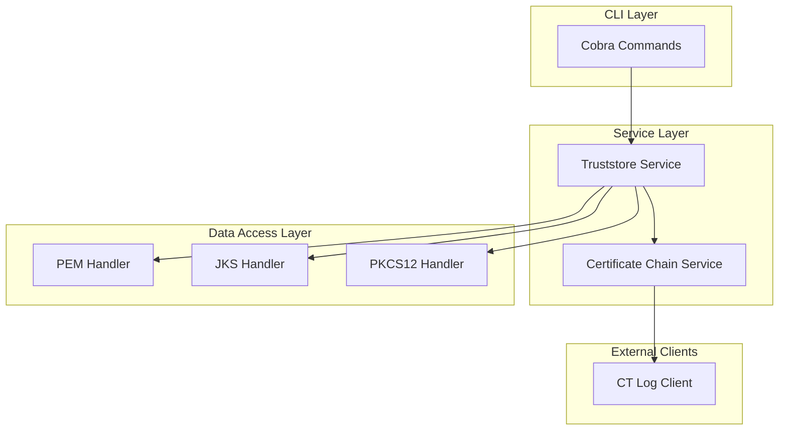

### 5. Components

#### `CLI (Cobra Commands)`

* **Responsibility:** This is the user-facing layer of the application. It defines the `list`, `add`, and `rm` commands, parses all user input (arguments and flags), and orchestrates the workflow by calling the appropriate services.
* **Key Interfaces:** Exposes the command-line interface (e.g., `truststore add ...`) to the user in the terminal.
* **Dependencies:** `Truststore Service`.
* **Technology Stack:** `Go`, `github.com/spf13/cobra`.

#### `Truststore Service`

* **Responsibility:** Acts as a central orchestrator or façade for all truststore operations. It determines the type of truststore file (PEM, JKS, etc.) and delegates the actual read/write operations to the correct handler.
* **Key Interfaces:** `ExecuteList(source)`, `ExecuteAdd(source, target)`, `ExecuteRemove(source, target)`.
* **Dependencies:** `Truststore Handlers`, `Certificate Chain Service`.
* **Technology Stack:** `Go`.

#### `Truststore Handlers` (Strategy Pattern Implementations)

* **Responsibility:** A group of components, each implementing the `Truststore` interface for a specific file format. This isolates the file-format-specific logic.
  * `PemHandler`: Reads and writes standard PEM files.
  * `JksHandler`: Reads and writes password-protected JKS files.
  * `Pkcs12Handler`: Reads and writes password-protected PKCS12 files.
* **Key Interfaces:** Each handler implements `ReadCertificates()`, `AddCertificate()`, `RemoveCertificate()`.
* **Dependencies:** `JKS Library`, `PKCS12 Library`.
* **Technology Stack:** `Go`, `keystore-go`, `go-pkcs12`.

#### `Certificate Chain Service`

* **Responsibility:** Implements the logic for building a complete certificate chain as required by the `add` and `rm` commands. It takes a certificate and uses the `CT Log Client` to recursively fetch any missing issuer certificates.
* **Key Interfaces:** `BuildChain(certificate)`.
* **Dependencies:** `CT Log Client`.
* **Technology Stack:** `Go`.

#### `CT Log Client`

* **Responsibility:** A simple HTTP client responsible for making requests to the public Certificate Transparency log service (e.g., `crt.sh`) and parsing the JSON response to extract certificate data.
* **Key Interfaces:** `FetchIssuersBySerial(serialNumber)`.
* **Dependencies:** Go's `net/http` client.
* **Technology Stack:** `Go`.

#### Component Diagram

