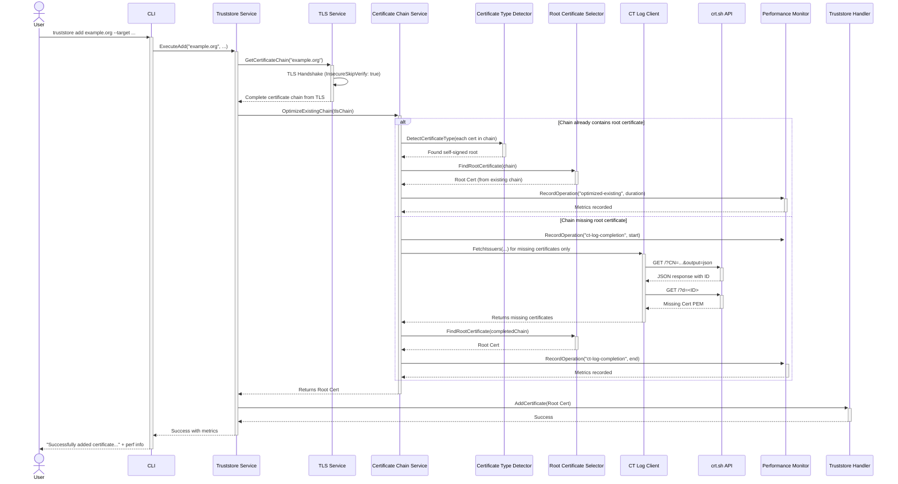

### 7. Core Workflows

This diagram illustrates the optimized sequence of events when a user runs the `truststore add example.org --target ...` command with enhanced chain completion that leverages existing TLS certificate chains.

