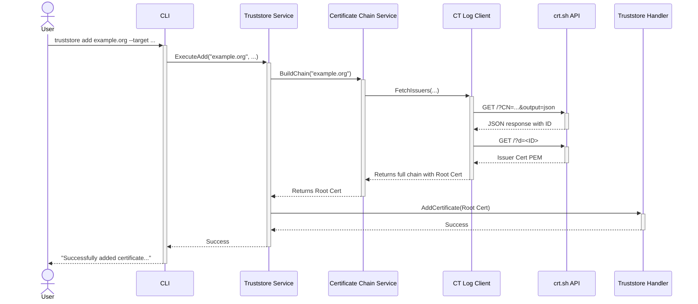

### 7. Core Workflows

This diagram illustrates the sequence of events when a user runs the `truststore add example.org --target ...` command.

```mermaid
sequenceDiagram
    actor User
    participant CLI
    participant TruststoreService as Truststore Service
    participant ChainService as Certificate Chain Service
    participant CTLogClient as CT Log Client
    participant crt_sh as crt.sh API
    participant TruststoreHandler as Truststore Handler

    User->>+CLI: truststore add example.org --target ...
    CLI->>+TruststoreService: ExecuteAdd("example.org", ...)
    TruststoreService->>+ChainService: BuildChain("example.org")
    ChainService->>+CTLogClient: FetchIssuers(...)
    CTLogClient->>+crt_sh: GET /?CN=...&output=json
    crt_sh-->>-CTLogClient: JSON response with ID
    CTLogClient->>+crt_sh: GET /?d=<ID>
    crt_sh-->>-CTLogClient: Issuer Cert PEM
    CTLogClient-->>-ChainService: Returns full chain with Root Cert
    ChainService-->>-TruststoreService: Returns Root Cert
    TruststoreService->>+TruststoreHandler: AddCertificate(Root Cert)
    TruststoreHandler-->>-TruststoreService: Success
    TruststoreService-->>-CLI: Success
    CLI-->>-User: "Successfully added certificate..."
```
